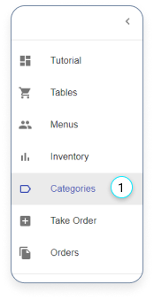
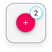
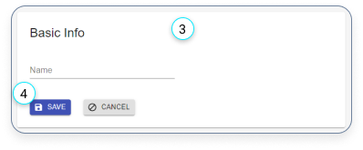
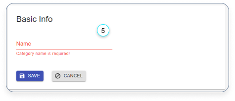
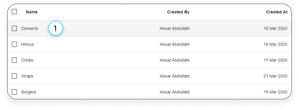
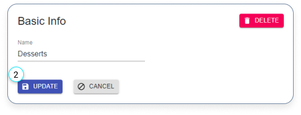
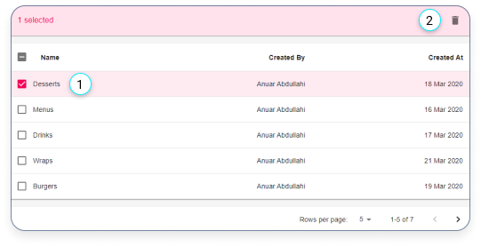
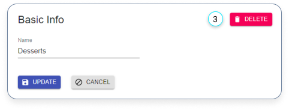

# Categories

-   [Categories](#categories)
    -   [Create a new category](#create-a-new-category)
    -   [Edit a category](#edit-a-category)
    -   [Delete inventory items](#delete-inventory-items)

## Create a new category

1. Click here if you want to add a category.

---

2. Click on the red plus button in the bottom right corner, if you want to create a new category.

---

3. Fill in the form.
4. Click on the ‘SAVE’ button

---

5. Make sure that a name is provided otherwise you can’t save the category.

## Edit a category

---

1. Click on a category if you want to edit.

---

2. Edit the item and click on the ‘UPDATE’ button.

## Delete inventory items

There are 2 ways to delete an item:

1. You can delete a single or multiple items by selecting the check-box.

2. Click on the delete icon.

---

3. The other way to delete an item is to select one of them in the table and click on the delete button.
