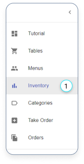
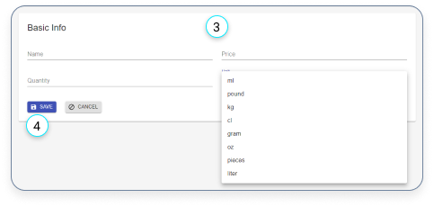
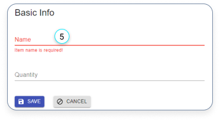
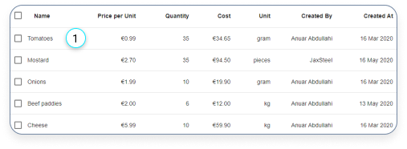
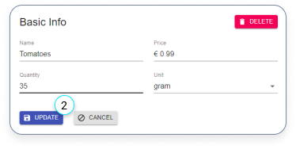
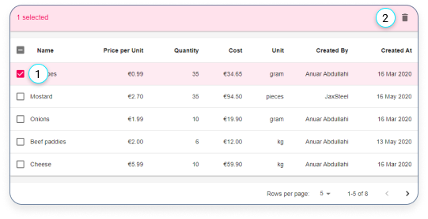
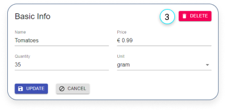

# Inventory

- [Inventory](#inventory)
  - [Create a new inventory item](#create-a-new-inventory-item)
  - [Edit an inventory item](#edit-an-inventory-item)
  - [Delete inventory items](#delete-inventory-items)

## Create a new inventory item

1. Click here if you want to add an inventory items.

---

2. Click on the red plus button in the bottom right corner, if you want to create a new item.

---

3. Fill in the form.
4. Click on the ‘SAVE’ button

---

5. Make sure that a name is provided otherwise you can’t save the item.

## Edit an inventory item

---

1. Click on an item if you want to edit.

---

2. Edit the item and click on the ‘UPDATE’ button.

## Delete inventory items

There are 2 ways to delete an item:

---

1. You can delete a single or multiple items by selecting the check-box.

2. Click on the delete icon.

---

3. The other way to delete an item is to select one of them in the table and click on the delete button.
