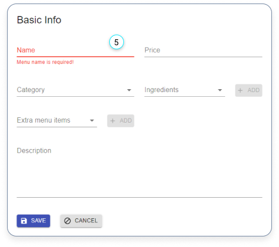

# Menus

- [Menus](#menus)
  - [Create a new menu](#create-a-new-menu)
  - [Edit a menu](#edit-a-menu)
  - [Delete menus](#delete-menus)

## Create a new menu

1. Click here if you want to add a menu.

---

2. Click on the red plus button in the bottom right corner, if you want to create a new menu.

---

3. Fill in the form.
4. Click on the ‘SAVE’ button

---

5. Make sure that a name is provided otherwise you can’t save the menu.

---

Other inputs:

6. Select the type of category the menu is.

7. Select ingridients and the app will update the inventory once an order has been finished.

8. Click ’+ Add’ to add the ingridient and fill in the amount.

9. Select extra menu item if the menu is a combination of items. The extra menu item comes from the ‘Menus’ list.

10. Click ’+ Add’ to add the extra menu item.

## Edit a menu

1. Click on a menu if you want to edit.

---

2. Edit the category and click on the ‘UPDATE’ button.

## Delete menus

There are 2 ways to delete an item:

1. You can delete a single or multiple menus by selecting the check-box.

2. Click on the delete icon.

---

3. The other way to delete a category is to select one of them in the table and click on the delete button.
