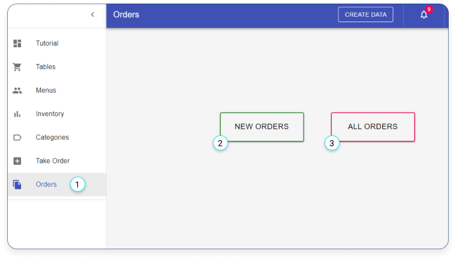
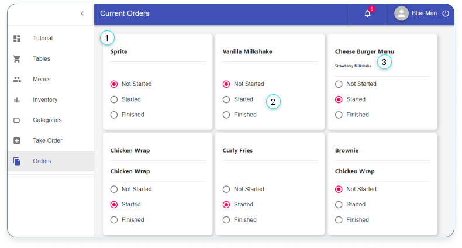
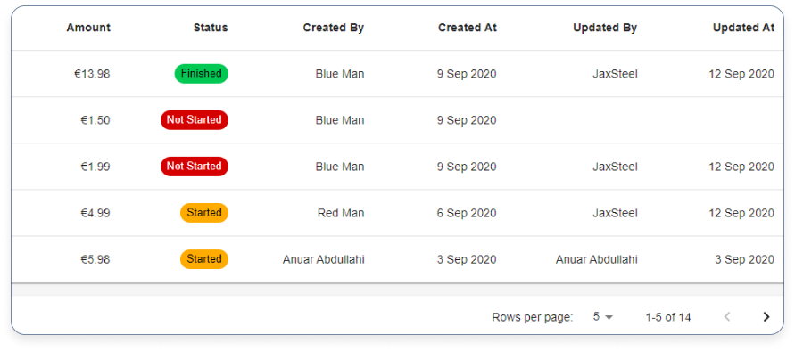

# Orders

- [Orders](#orders)
  - [Orders list](#orders-list)
  - [Current orders](#current-orders)
  - [All orders](#all-orders)

## Orders list

1. Click here if you want to see the orders.

2. Click on ‘NEW ORDERS’ to see the current orders.

3. Click on ‘ALL ORDERS’ to see all orders that have been made.

---

## Current orders

1. Current order ticket.

2. The status of the order.

3. What has been ordered.

---

## All orders

Here is where you can find all orders that have been made.
