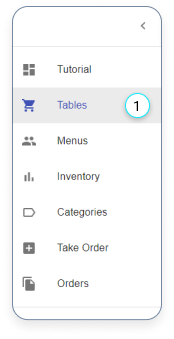
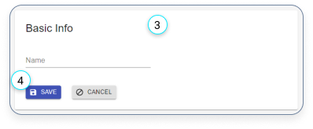
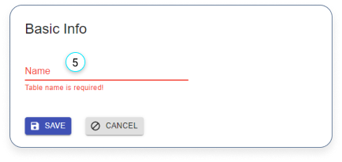
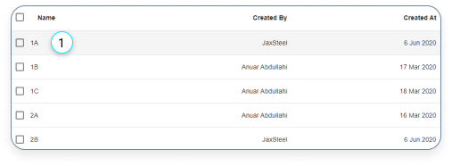
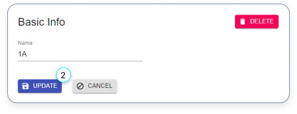
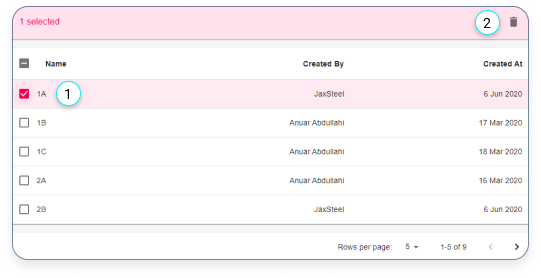
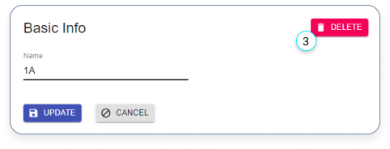

# Tables

- [Tables](#tables)
  - [Create a new table](#create-a-new-table)
  - [Edit a table](#edit-a-table)
  - [Delete tables](#delete-tables)

## Create a new table

1. Click here if you want to add a table.

---

2. Click on the red plus button in the bottom right corner, if you want to create a new table.

---

3. Fill in the form.
4. Click on the ‘SAVE’ button

---

5. Make sure that a name is provided otherwise you can’t save the table.

## Edit a table

---

1. Click on a table if you want to edit.

---

2. Edit the table and click on the ‘UPDATE’ button.

## Delete tables

There are 2 ways to delete an item:

---

1. You can delete a single or multiple tables by selecting the check-box.

2. Click on the delete icon.

---

3. The other way to delete a table is to select one of them in the table and click on the delete button.
