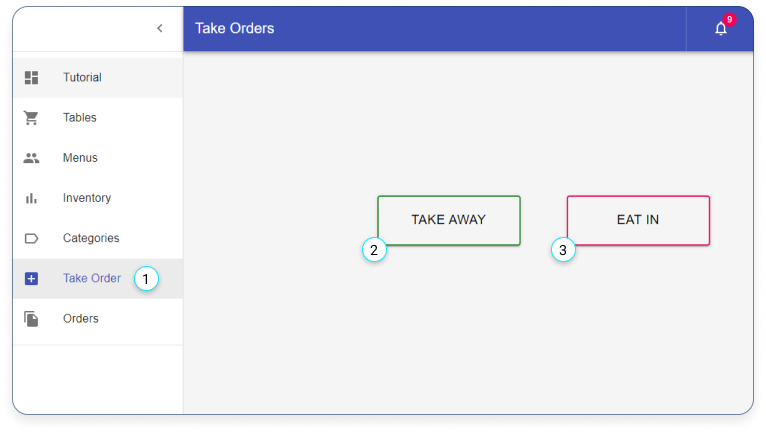
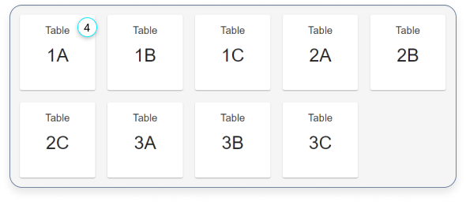
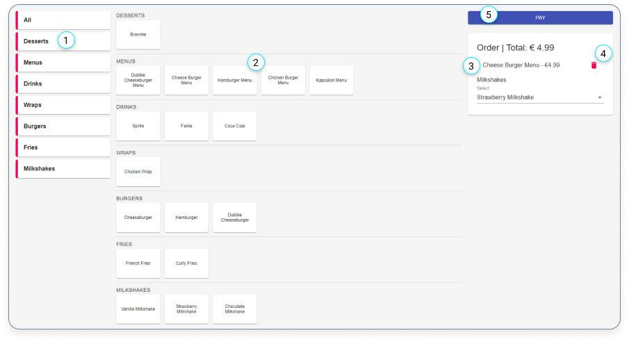
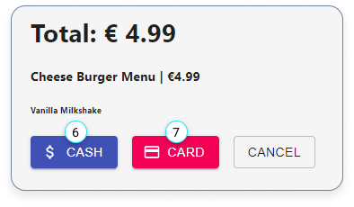
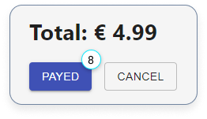

# Take Orders

- [Take Orders](#take-orders)
  - [Create a new order](#create-a-new-order)
  - [Take an order](#take-an-order)

## Create a new order

1. Click here if you want to create a new order.

2. Click on ‘TAKE AWAY’ if the order is a take-away.

3. Click on ‘EAT IN’ if the customer wants to eat in.

---

4. Click on a table if you have clicked on the ‘Eat In’ button

---

## Take an order

1. Filter the menus by category.

2. Menu items.

3. Order ticket.

4. Delete a menu item.

5. Pay button.

---

6. When the client prefers to pay with cash.

7. When the client prefers to pay with a card.

---

8. A order ticket will be created after you click ‘PAYED’.
